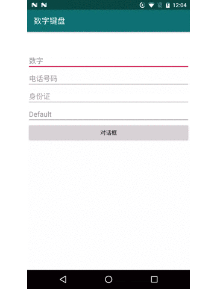

 [博客地址](https://blog.csdn.net/a394268045/article/details/86702363)

# 1.效果图


# 2.使用方法
## 2.1 给EditText设置tag属性
```xml
<EditText
    android:layout_width="match_parent"
    android:layout_height="wrap_content"
    android:hint="数字"
    android:imeActionLabel="完成"
    android:maxLines="1"
    android:tag="number" />
```


## 2.2 在activity/fragment中弹框
```java
/**
* 默认隐藏
*/
KeyboardClient keyboardClient = KeyboardClient.newKeyboard(this.getWindow());
//想要默认显示的话，添加下面这个语句
keyboardClient.showKeyboard();

```

## 2.3 在Dialog中弹框
```java
final View view = LayoutInflater.from(MainActivity.this).inflate(R.layout.activity_main, null);
final AlertDialog dialog = new AlertDialog.Builder(this)
        .setView(view)
        .create();
//自定义dialog必加
dialog.getWindow().setGravity(Gravity.TOP);

findViewById(R.id.btn).setOnClickListener(new View.OnClickListener() {
    @Override
    public void onClick(View v) {

        KeyboardClient dialogKeyboard = KeyboardClient.newKeyboard(dialog.getWindow(), false);
        dialogKeyboard.showKeyboard();
        dialog.show();

    }
});
```
